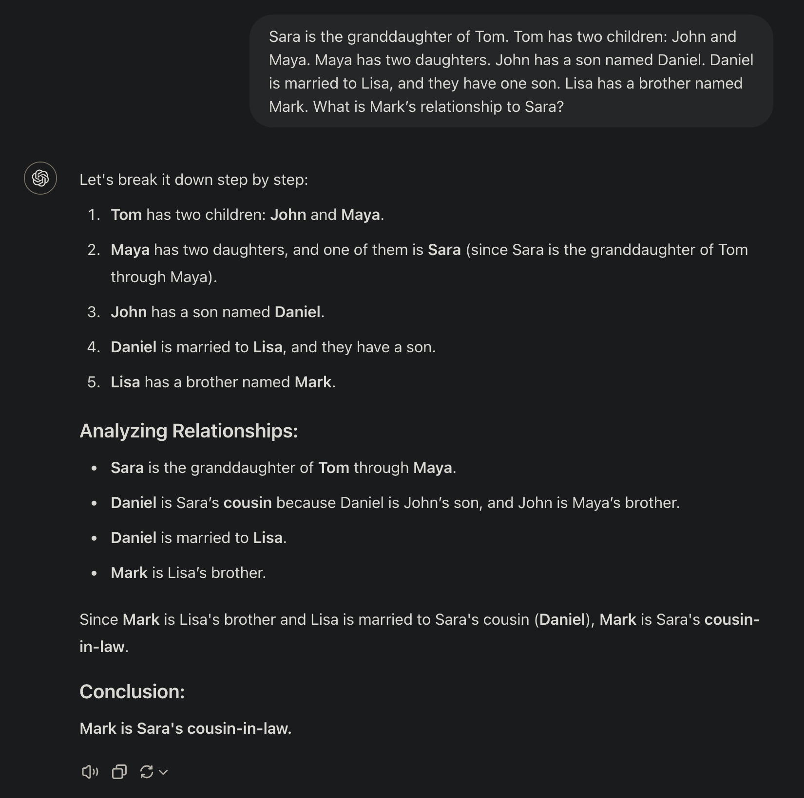
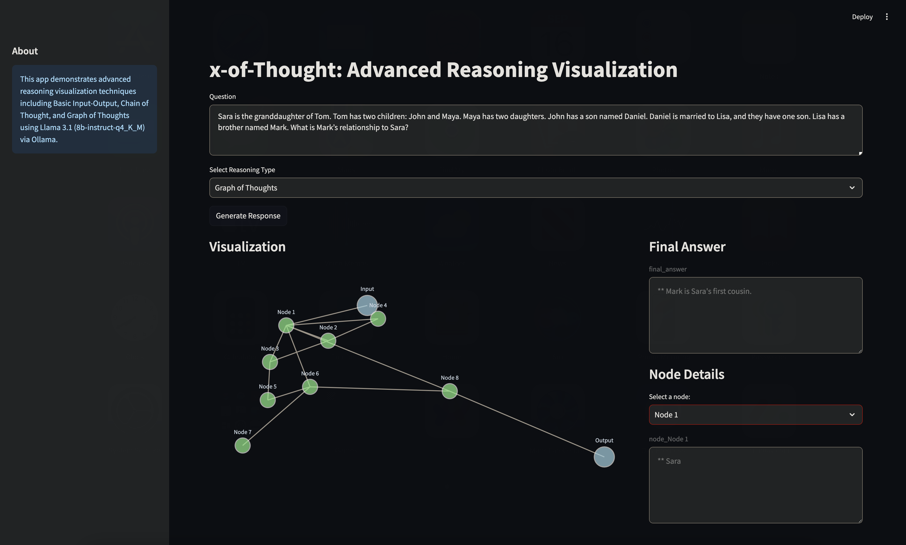
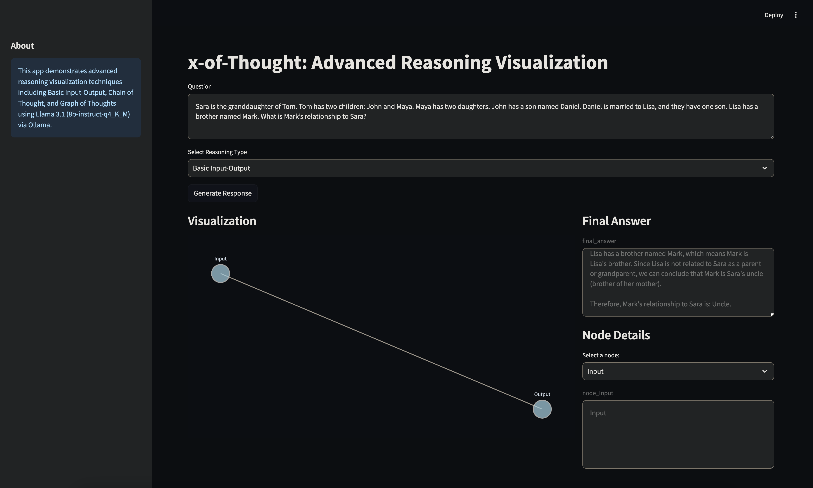
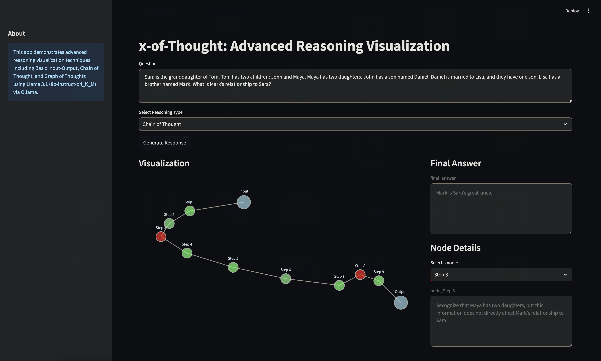

# x-of-Thought: Advanced Reasoning Visualization

<!--  -->
<center>

</center>

## Overview

x-of-Thought is an innovative project that demonstrates advanced reasoning visualization techniques using state-of-the-art language models. This application leverages the Llama 3.1 (8b-instruct-q4_K_M) model via Ollama to generate structured responses to user queries, providing insights into different reasoning processes.

## Key Features

- **Multiple Reasoning Types**: Supports Basic Input-Output, Chain of Thought, and Graph of Thoughts reasoning methodologies.
- **Interactive Visualization**: Utilizes Plotly to create dynamic, interactive graph visualizations of the reasoning process.
- **Streamlit Interface**: Offers a user-friendly web interface for seamless interaction with the model and result visualization.
- **Dynamic Node Analysis**: Enables users to explore individual nodes in the reasoning graph for detailed insights.
- **Sentiment Analysis**: Incorporates sentiment analysis for each reasoning step, visually represented in the graph.

## Project Structure

```
.
├── __pycache__/
├── llm_setup.py
├── main.py
├── parsing.py
├── prompts.py
├── visualization.py
├── requirements.txt
└── README.md
```

## Installation

1. Clone the repository:
   ```
   git clone https://github.com/himudigonda/x-of-thought.git
   cd x-of-thought
   ```

2. Install dependencies:
   ```
   pip install -r requirements.txt
   ```

3. Ensure Ollama is installed and the Llama 3.1 (8b-instruct-q4_K_M) model is available.

## Usage

1. Run the application:
   ```
   streamlit run main.py
   ```

2. Open your web browser and navigate to the provided local URL (typically `http://localhost:8501`).

3. Enter a question in the text area.

4. Select a reasoning type from the dropdown menu:
   - Basic Input-Output
   - Chain of Thought
   - Graph of Thoughts

5. Click "Generate Response" or press Enter.

6. Explore the generated graph visualization and final answer.

7. Use the node selection dropdown to view detailed information about specific reasoning steps.

## Components

### llm_setup.py
Sets up the language model using Ollama and defines the language model chains for different reasoning types.

### main.py
The core Streamlit application that handles user input, generates responses, and manages the overall user interface.

### parsing.py
Contains specialized functions to parse different types of responses from the language model:
- `parse_basic_response()`: Handles basic input-output format.
- `parse_cot_response()`: Processes Chain of Thought responses.
- `parse_got_response()`: Parses Graph of Thoughts responses, including node deletions.

### prompts.py
Defines prompt templates for different reasoning types:
- Basic Input-Output: Simple question-answer format.
- Chain of Thought: Structured step-by-step reasoning.
- Graph of Thoughts: Complex graph-based reasoning with node connections and deletions.

### visualization.py
Implements functions to create interactive visualizations of the reasoning process:
- `create_graph_visualization()`: Generates the main graph visualization using Plotly.
- `create_force_directed_layout()`: Computes the layout for the graph visualization.

## Advanced Features

- **Sentiment Analysis**: Each node in the Chain of Thought and Graph of Thoughts is analyzed for sentiment (Positive/Negative/Neutral), visually represented by node colors.
- **Dynamic Graph Updates**: The Graph of Thoughts visualization supports node deletions, reflecting the evolving nature of complex reasoning.
- **Scalable Visualization**: The force-directed layout ensures clear visualization even for complex reasoning graphs.

## Results
<center>
<table>
  <tr>
    <td>
      <figure>
        
        <figcaption>Output from ChatGPT (4o)</figcaption>
      </figure>
    </td>
    <td>
      <figure>
        
        <figcaption>Basic Input/Output (io)</figcaption>
      </figure>
    </td>
  </tr>
  <tr>
    <td>
      <figure>
        
        <figcaption>Chain of Thought (CoT)</figcaption>
      </figure>
    </td>
    <td>
      <figure>
        
        <figcaption>Graph of Thought (GoT)</figcaption>
      </figure>
    </td>
  </tr>
</table>
</center>

## Contributing

We welcome contributions to the x-of-Thought project! Please follow these steps:

1. Fork the repository.
2. Create a new branch for your feature or bug fix.
3. Commit your changes with clear, descriptive messages.
4. Push your branch and submit a pull request.

For major changes, please open an issue first to discuss the proposed changes.

## License

This project is licensed under the MIT License. See the [LICENSE](LICENSE) file for details.

## Acknowledgments

- Ollama team for Ollama
- Meta for developing the Llama 3.1 model.
- Streamlit for their excellent framework for building data applications.
- The open-source community for various libraries used in this project.

## Contact

For questions or feedback, please open an issue in the GitHub repository or contact the maintainers directly.
